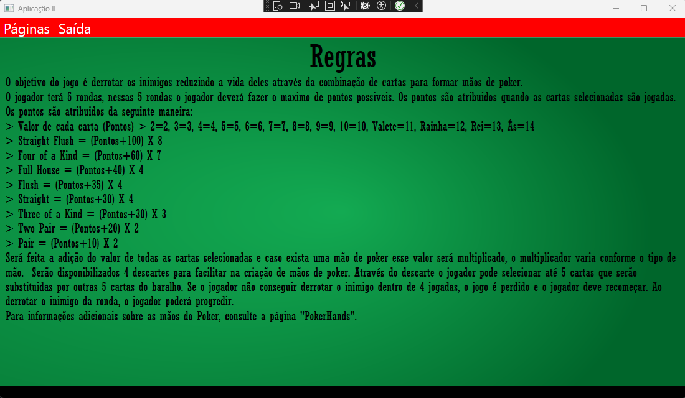

# Balatro - WPF Application

This project was inspired by the original **Balatro** game, integrating similar gameplay mechanics in a WPF environment.  
Additionally, the **bosses** featured throughout the game are inspired by characters from **Cuphead**, providing a nostalgic and challenging atmosphere.

WPF application developed in C# using the MVC architecture and CRUD operations with SQL Server.  
The project demonstrates skills in OOP, ADO.NET, and UI design, emphasizing functionality, visual appeal, and innovation.

---

## 🔊 Audio Features

Throughout the gameplay, the project includes several background audio tracks and sound effects to enhance the experience.  
- Background **boss music** plays during battles to create immersion.  
- The sound effect **`knockout.wav`** is played when an enemy is defeated.  
- The sound effect **`DevilOminous.wav`** is triggered when the player defeats the **Fifth Boss** in the first phase of the game.

You can preview some of these sounds below:

🎧 **Audio Samples**

<audio controls>
  <source src="https://raw.githubusercontent.com/teu-usuario/Balatro-WPF/main/Audios/knockout.wav" type="audio/wav">
  Your browser does not support the audio element.
</audio>

<audio controls>
  <source src="https://raw.githubusercontent.com/teu-usuario/Balatro-WPF/main/Audios/DevilOminous.wav" type="audio/wav">
  Your browser does not support the audio element.
</audio>

---

## 🧩 Features & Screenshots

Below are the main features and game screens of **Balatro**, a WPF project developed in C# using the MVC architecture and SQL Server integration.

---

### 👤 User Creation

When accessing the **User Creation** page, the player can create a new **Player (Jogador)** profile.  
This profile functions as an account that will be used to play the **Balatro** game.

---

### 📜 Game Rules

The **Rules** screen provides an overview of the game’s mechanics and explains the basic concepts needed to understand the gameplay.

---

### 💰 Paying to Play

Before starting the first round, the player must select their account and **pay to play**.  
This screen represents the transition between setup and the beginning of the game.

---

### 🃏 Hands Reference

The **Hands** screen shows the different possible hands, similar to poker combinations.  
It serves as a quick reference for players who may not remember all the hand types during gameplay.

---

## 🎮 Game Progression

Below are several screenshots demonstrating progression through different bosses and rounds in **Balatro**.

| First Round | First Boss | First Boss Defeated |
|--------------|-------------|----------------------|
|  |  |  |

| Second Boss | Third Boss | Fourth Boss |
|--------------|-------------|--------------|
|  |  |  |

| Fifth Boss First Phase | Sixth Boss Second Phase |
|-------------|-------------|
|  |  |

---

🕹️ *Balatro combines strategic gameplay, deck management, and poker-inspired mechanics, providing an engaging experience built entirely in WPF and C#.*
